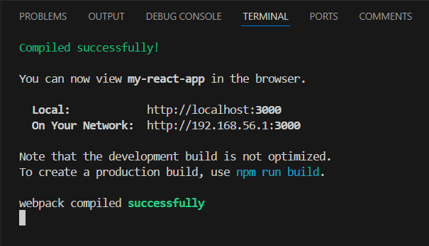
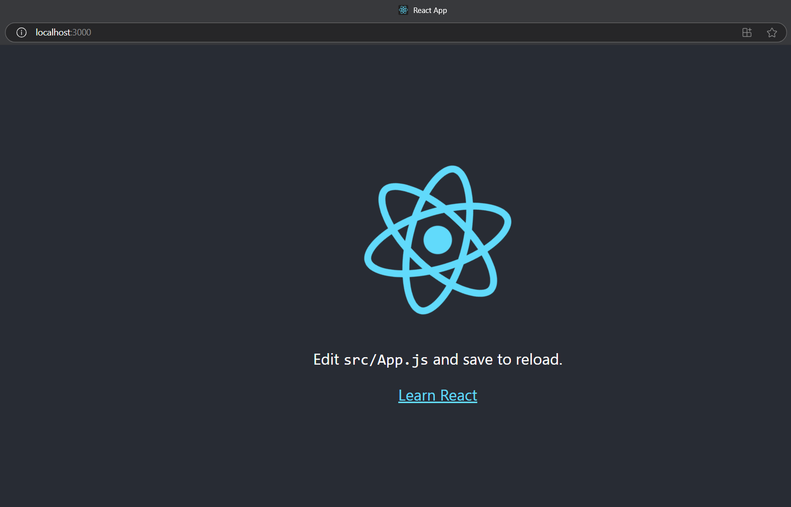
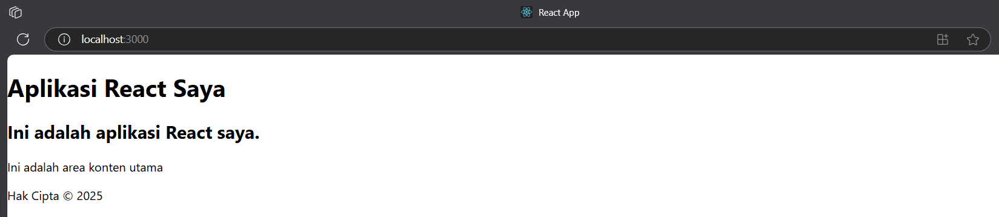
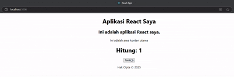
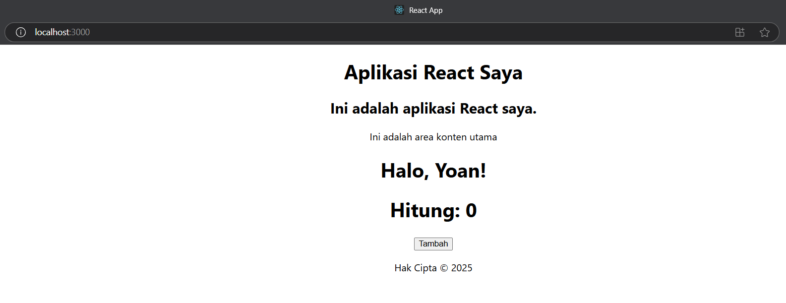
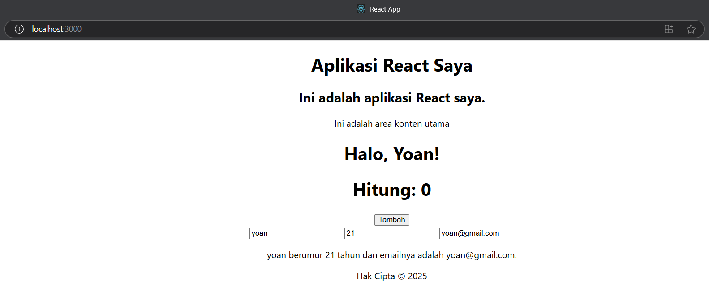
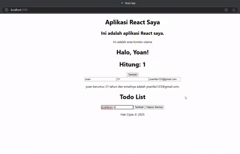

## Laporan Praktikum

|       | Pemrograman Berbasis Framework 2025 |
| ----- | ----------------------------------- |
| NIM   | 2241720096                          |
| Nama  | Muhammad Yoanvari Al Farizi         |
| Kelas | TI - 3B                             |

### 1: Persiapan Lingkungan

> 

> 

### 2: Membuat Komponen React

> 

### 3: Menggunakan JSX untuk Membuat Komponen Dinamis

> 

### 4: Menggunakan Props untuk Mengirim Data

> 

### 5: Menggunakan State untuk Mengelola Data

> 

### Tugas Praktikum

1. Buat komponen baru bernama TodoList yang menampilkan daftar tugas (todo list). Gunakan state untuk mengelola daftar tugas dan props untuk mengirim data tugas ke komponen anak.
2. Tambahkan fitur untuk menambahkan tugas baru ke dalam daftar menggunakan form input.
3. Implementasikan fitur untuk menghapus tugas dari daftar.

> 
